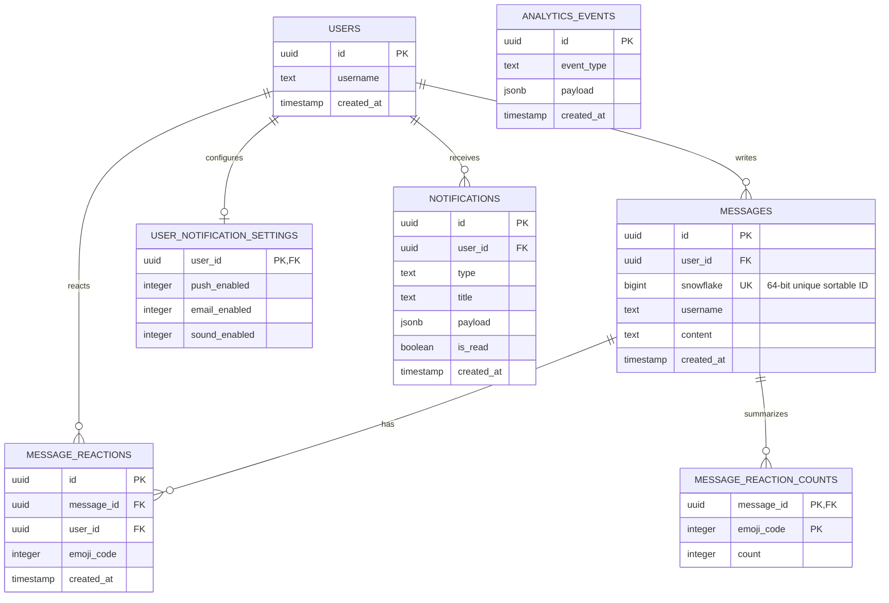

# 01. Architecture and Tech Stack Analysis

This document provides a breakdown of the entire technology stack, project directory structure, database models, and service boundaries used in the **Demo Discord** application.

---

## 🛠️ Complete Technology Stack

### 1. Backend Core & Runtime
* **Runtime**: [Node.js](https://nodejs.org/) (ES Modules `type: "module"`)
* **HTTP Framework**: [Express 5](https://expressjs.com/) (v5.2.1) — Handles REST endpoints, authentication, health checks, and historical message pagination.
* **WebSocket Engine**: [Socket.io](https://socket.io/) (v4.8.3) — Powers bidirectional real-time communication for chat, presence, typing indicators, and WebRTC signaling.
* **Cluster Adapter**: `@socket.io/redis-adapter` (v8.3.0) — Synchronizes socket rooms, broadcasts, and disconnections across multiple Node.js processes.
* **Process Orchestration**: [PM2](https://pm2.keymetrics.io/) / [Nodemon](https://nodemon.io/) — Clustering across multiple cores (`NODE_APP_INSTANCE`).

### 2. Real-Time Media & Voice Engine
* **Media Server**: [Mediasoup](https://mediasoup.org/) (v3.19.17) — A Selective Forwarding Unit (SFU) written in C++ with a Node.js API. It handles WebRTC RTP/SRTP packet forwarding, DTLS handshake, ICE negotiation, and active speaker detection.
* **Concurrency Control**: `p-limit` (v7.3.0) — Controls concurrent asynchronous operations against media workers and Redis pipelines.

### 3. Data Storage & Ingestion Pipeline
* **Database**: [PostgreSQL](https://www.postgresql.org/) (via `pg` v8.17.2) — Persistent relation storage for users, messages, reactions, notification settings, and analytics.
* **ORM & Migrations**: [Drizzle ORM](https://orm.drizzle.team/) (v0.45.1) + `drizzle-kit` (v0.31.10) — Type-safe SQL query builder and schema migration tool.
* **In-Memory Cache & Streams**: [Redis](https://redis.io/) (via `ioredis` v5.11.0) — Powers:
  - **Redis Streams (`stream:messages`)**: Message buffer decoupling WebSocket ingestion from PostgreSQL writes.
  - **Redis Pub/Sub**: Message acknowledgments, socket cross-node synchronization.
  - **Presence Store**: Online user sets and heartbeats with TTLs.
  - **Sliding-Window Rate Limiter**: Per-user message throttling.
* **Background Queue**: [BullMQ](https://docs.bullmq.io/) (v5.78.0) — Asynchronous background queue for heavy tasks such as user notifications and analytics processing.

### 4. Frontend Application
* **Framework**: [Next.js 16](https://nextjs.org/) (v16.1.4) using the App Router (`app/`).
* **UI Library**: [React 19](https://react.dev/) (v19.2.3).
* **Language**: [TypeScript 5](https://www.typescriptlang.org/).
* **Styling**: [TailwindCSS v4](https://tailwindcss.com/) (`@tailwindcss/postcss` v4).
* **WebRTC Client**: `mediasoup-client` (v3.18.7) — Manages browser WebRTC `RTCPeerConnection`, transports, device capabilities, producers, and consumers.
* **WebSocket Client**: `socket.io-client` (v4.8.3) — Connects to default namespace (`/`) for chat/presence and dedicated namespace (`/voice`) for signaling.

---

## 📁 Repository Structure Overview

```
demo-discord/
├── backend/
│   ├── src/
│   │   ├── controllers/         # REST API route handlers (auth, messages, users)
│   │   ├── db/                  # PostgreSQL connection (Drizzle ORM) & table schemas
│   │   ├── events/              # Internal Node.js EventBus & event publishers
│   │   ├── gateways/            # Gateway abstraction for socket namespaces
│   │   ├── queues/              # BullMQ queue instances (analytics, notifications)
│   │   ├── redis/               # Redis connection, PubSub, presence, rate-limiting & streams
│   │   │   ├── messageStream/   # Redis Streams producer for chat messages
│   │   │   ├── reactions/       # In-memory Redis reaction engine & stream producer
│   │   │   ├── pubsub/          # Pub/Sub channels, publishers, and subscribers
│   │   │   └── presence.js      # Redis presence storage & heartbeat refreshes
│   │   ├── routes/              # Express API route declarations
│   │   ├── services/            # Business logic layer
│   │   ├── voice/               # Mediasoup voice/video SFU engine & socket signaling
│   │   │   ├── mediasoup.js     # Multi-core C++ worker pool management & auto-restart
│   │   │   └── voice.socket.js  # Voice namespace (/voice) signaling & consumer routing
│   │   ├── workers/             # Background consumer workers
│   │   │   ├── messageStreamConsumer.worker.js  # Chat stream consumer -> PostgreSQL batch flusher
│   │   │   ├── reactionStreamConsumer.worker.js # Reaction stream consumer -> PostgreSQL batch flusher
│   │   │   ├── notification.worker.js           # BullMQ notification job worker
│   │   │   └── analytics.worker.js              # BullMQ analytics job worker
│   │   ├── app.js               # Express application setup, middlewares, routes
│   │   ├── health.js            # Health check routes & system metrics
│   │   ├── server.js            # HTTP + Socket.io server bootstrapper
│   │   ├── snowflake.js         # Distributed Twitter Snowflake 64-bit ID generator
│   │   └── socket.js            # Primary Socket.io server (chat, presence, typing)
│   ├── drizzle.config.js        # Drizzle ORM configuration
│   └── package.json             # Backend dependencies & scripts
│
├── frontend/
│   ├── app/                     # Next.js App Router pages
│   │   ├── chat/page.tsx        # Global chat view with infinite scroll & presence
│   │   ├── dashboard/page.tsx   # Hub page for joining chat or voice rooms
│   │   ├── voice/page.tsx       # Global voice & video room view
│   │   ├── layout.tsx           # Global HTML shell & metadata
│   │   └── page.tsx             # Login / user onboarding page
│   ├── components/              # Complex interactive React components
│   │   ├── ChatBox.tsx          # Real-time chat interface, message queues, auto-scroll
│   │   └── VoiceRoom.tsx        # WebRTC voice/video grid, focus/gallery mode, media toggles
│   ├── hooks/
│   │   └── useAuthSocket.ts     # User authentication socket session synchronization
│   ├── lib/                     # Client singletons (socket, voiceSocket)
│   └── package.json             # Frontend dependencies & scripts
│
├── test/
│   ├── connection/              # WebRTC & socket connection tests
│   ├── load/                    # HTTP and pagination load testing scripts
│   └── stress/                  # Artillery / Autocannon socket stress scenarios
└── docs/                        # Comprehensive Architecture & Engineering Reports
```

---

## 🗄️ Database Models (Drizzle ORM)

The relational schema is configured in [`backend/src/db/schema.js`](file:///c:/Users/Sulaiman/Desktop/dis/backend/src/db/schema.js) using PostgreSQL primitives:



### Key Schema Design Decisions:
1. **64-bit BigInt Snowflake Field**: Stored as a string mode BigInt in Drizzle (`bigint("snowflake", { mode: "string" }).unique()`) to avoid JavaScript 53-bit integer precision loss.
2. **Pre-aggregated Reaction Counters**: Uses `message_reaction_counts` composite primary key (`(message_id, emoji_code)`) to allow $O(1)$ fast lookup of reaction tallies without requiring expensive `COUNT(*)` database aggregations.
3. **Audit Trail vs Aggregation**: `message_reactions` maintains the raw audit trail (who reacted to what), while `message_reaction_counts` maintains the read-optimized counters for fast UI rendering.
