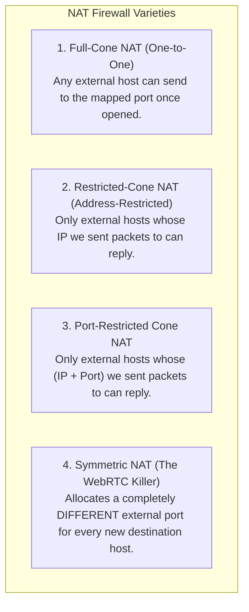
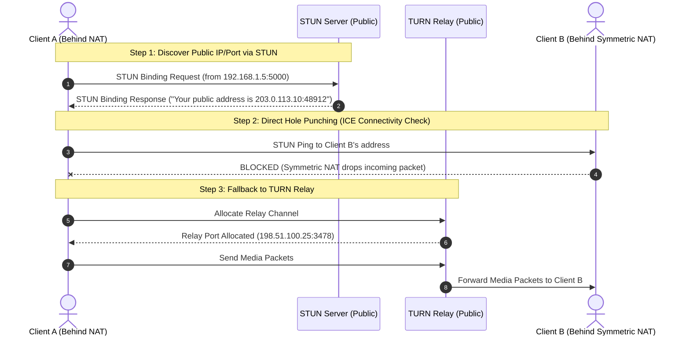
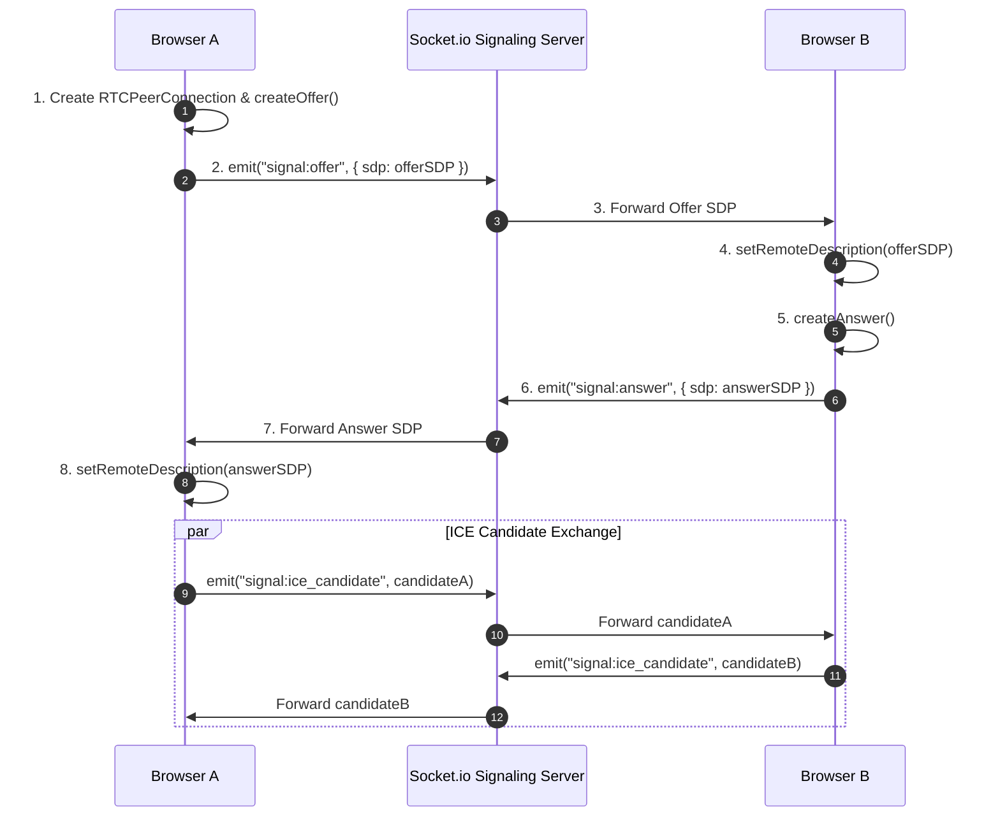
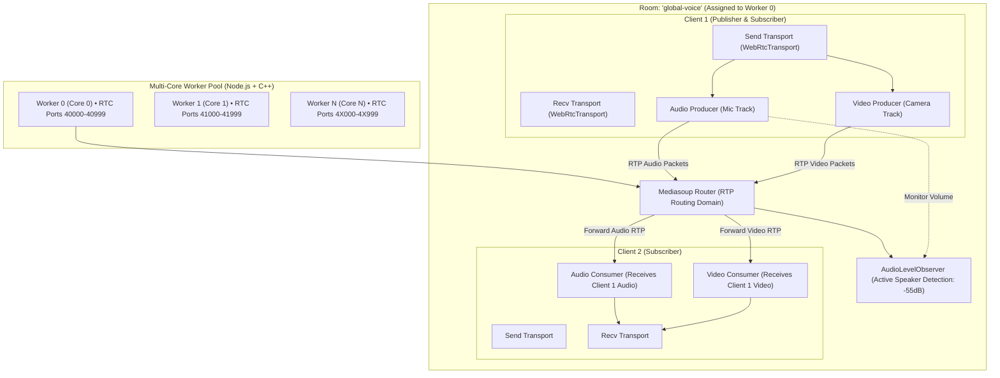

# 02. WebRTC, NAT Traversal & Media Routing Deep Dive

This document is an exhaustive, foundational guide and technical reference explaining **WebRTC from first principles**, **NAT (Network Address Translation)**, **Firewall Traversal (STUN, TURN, ICE)**, **Signaling & SDP**, **Media Protocols (RTP, SRTP, RTCP)**, **Multi-Party Topologies (Mesh vs. MCU vs. SFU)**, and the **Mediasoup Multi-Core SFU Engine** implemented in **Demo Discord**.

---

## 🌐 1. What is WebRTC? (First Principles)

### Core Mission
**WebRTC (Web Real-Time Communication)** is an open-source standard and suite of protocols designed to enable web browsers and mobile applications to exchange real-time **audio, video, and arbitrary binary data** with ultra-low latency (typically **< 50ms – 150ms**) without requiring external plugins or third-party software.

### The 3 Core Browser JavaScript APIs:
1. **`MediaDevices.getUserMedia()` / `getDisplayMedia()`**: Captures raw audio from microphones, video from webcams, or screenshares into browser `MediaStream` objects.
2. **`RTCPeerConnection`**: The core WebRTC engine. Handles audio/video codec negotiation, network path resolution (ICE), encryption key derivation (DTLS/SRTP), packetization, jitter buffering, packet loss concealment, and hardware-accelerated video rendering.
3. **`RTCDataChannel`**: Allows bidirectional, peer-to-peer arbitrary data transfer (binary or text) over SCTP with configurable reliability (TCP-like guaranteed delivery or UDP-like unordered fast streaming).

---

## 🧱 2. Why WebRTC Uses UDP Instead of TCP

Standard web traffic (HTTP, WebSocket, HTTPS) runs over **TCP (Transmission Control Protocol)**. WebRTC media streaming runs over **UDP (User Datagram Protocol)**.

```
       TCP (Reliable, High Latency)                       UDP (Unreliable, Real-Time)
   Client                  Server                     Client                  Server
     |                       |                          |                       |
     |---- Packet 1 -------->| (Received)               |---- Packet 1 -------->| (Received)
     |---- Packet 2 (LOST) ->x (Lost in transit)        |---- Packet 2 (LOST) ->x (Lost, IGNORED)
     |---- Packet 3 -------->| (Held in buffer!)        |---- Packet 3 -------->| (Played instantly!)
     |                       |                          |                       |
     |<--- NACK / Retrans ---| (Wait 100ms)             |                       |
     |---- Packet 2 Resent ->| (Now plays 1,2,3)        |                       |
   RESULT: Glitch & 200ms audio freeze                RESULT: Seamless 0ms lag audio
```

### The Concept: Head-of-Line (HoL) Blocking
- **TCP guarantees that every single packet is delivered in exact order**. If Packet 2 is dropped by network congestion, TCP **halts all subsequent packets (3, 4, 5)** in the receive queue until Packet 2 is retransmitted and acknowledged.
- In live voice/video, **old data is useless data**. If a voice syllable from 200ms ago was dropped, users would rather hear a tiny masked glitch than have the entire conversation freeze for a quarter of a second.
- **UDP does not retransmit lost packets by default** and does not block new packets. WebRTC layers its own smart error-resilience algorithms on top of UDP (such as Opus Forward Error Correction and NACKs).

---

## 🛡️ 3. The WebRTC Network Protocol Stack

```
 +---------------------------------------------------------+
 |           WebRTC Application (Next.js / React)          |
 +---------------------------------------------------------+
 |       Voice / Video Tracks       |      DataChannels    |
 +----------------------------------+----------------------+
 |           SRTP / SRTCP           |         SCTP         |
 +----------------------------------+----------------------+
 |                           DTLS                          |
 +---------------------------------------------------------+
 |                     ICE / STUN / TURN                   |
 +---------------------------------------------------------+
 |                            UDP                          |
 +---------------------------------------------------------+
 |                             IP                          |
 +---------------------------------------------------------+
```

1. **IP (Internet Protocol)**: Delivers packets from source IP to destination IP.
2. **UDP (User Datagram Protocol)**: Unreliable, connectionless, low-overhead transport.
3. **ICE / STUN / TURN**: Discovers public IP paths and bypasses NAT firewalls.
4. **DTLS (Datagram Transport Layer Security)**: TLS over datagrams. Generates cryptographic keys and authenticates the connection.
5. **SRTP (Secure Real-time Transport Protocol)**: Encrypts raw audio (Opus) and video (VP8/VP9/H.264/AV1) payloads using AES-128/256 cipher keys generated by DTLS.
6. **SCTP (Stream Control Transmission Protocol)**: Transports DataChannels on top of DTLS.

---

## 🌍 4. What is NAT? (Network Address Translation)

### Why Does NAT Exist?
When IPv4 was created in 1981, it allocated $2^{32} \approx 4.3 \text{ billion}$ IP addresses. As billions of phones, laptops, and IoT devices came online, IPv4 addresses were exhausted.

To solve this, **RFC 1918** designated three private IP ranges for local area networks (LANs):
- `10.0.0.0` – `10.255.255.255` (Class A)
- `172.16.0.0` – `172.31.255.255` (Class B)
- `192.168.0.0` – `192.168.255.255` (Class C)

**Private IPs are non-routable on the public internet**. Millions of homes and offices share the exact same `192.168.1.x` addresses.

### How NAT Works (The Router Translation Table)
Your home or office router has **one single Public IP address** provided by your ISP. The router acts as a translator between your internal devices and the outside internet:

```
[Laptop: 192.168.1.5:54321]  --+
                               |--> [Home Router (Public IP: 203.0.113.10)] ---> Internet (Web Server: 93.184.216.34:443)
[Phone:  192.168.1.9:54321]  --+
```

When your laptop connects to a website, the router modifies the IP packet headers:
1. Replaces `192.168.1.5:54321` with `203.0.113.10:49152`.
2. Stores this translation in its internal **NAT State Table**:
   | Internal Source IP:Port | External Mapped IP:Port | Destination IP:Port |
   | :--- | :--- | :--- |
   | `192.168.1.5:54321` | `203.0.113.10:49152` | `93.184.216.34:443` |
3. When the web server replies to `203.0.113.10:49152`, the router checks the table and rewrites the packet destination back to `192.168.1.5:54321`.

---

## 🚫 5. The Core NAT Challenge for Peer-to-Peer & WebRTC

In standard web browsing (Client-Server), the **client always initiates the outgoing connection**, which opens the NAT table pinhole.

In real-time media (Peer-to-Peer or Client-to-SFU):
- Client A (`192.168.1.5`) wants to receive audio from Client B (`192.168.0.22`).
- If Client A tells Client B: *"Send packets to 192.168.1.5:40000"*, Client B's packets cannot reach Client A because `192.168.1.5` is private.
- If Client B sends packets to Client A's public router IP (`203.0.113.10:40000`), **Client A's router immediately drops the packets** because no outgoing request was made to open that port in the NAT table!

### The 4 Types of NAT (From Easiest to Hardest)



1. **Full-Cone NAT**: Once an internal host sends a packet out, *any* external host on the internet can send packets back to that mapped public port. (STUN hole-punching succeeds 100%).
2. **Address-Restricted Cone NAT**: An external host can send packets to the mapped port only if the internal host has previously sent a packet to that external host's IP address.
3. **Port-Restricted Cone NAT**: Common in home WiFi routers. An external host can send packets only if the internal host previously sent a packet to that specific IP **and** Port.
4. **Symmetric NAT**: Used in corporate firewalls, universities, and mobile LTE/5G carrier networks. If Client A sends a packet to STUN Server X, the router maps it to Port `50001`. But when Client A sends a packet to Client B, the router assigns Port `50002`! Because the port changes dynamically, **direct peer hole punching is mathematically impossible**.

---

## 🛠️ 6. The NAT Traversal Toolkit: STUN, TURN & ICE

To overcome NAT firewalls, WebRTC uses the **ICE framework** backed by **STUN** and **TURN** servers.



### 1. STUN (Session Traversal Utilities for NAT - RFC 5389)
- **Role**: A lightweight public mirror.
- **How it works**: Client sends a UDP request to `stun.l.google.com:19302`. The STUN server inspects the packet header and returns the client's public reflexive IP and Port (`srflx` candidate).
- **Cost & Overhead**: Extremely low (consumes almost zero CPU or bandwidth). STUN only handles the handshake, never the media stream.

### 2. TURN (Traversal Using Relays around NAT - RFC 5766)
- **Role**: The bulletproof relay fallback when symmetric NATs prevent direct connection (occurs in ~10-15% of internet connections).
- **How it works**: Both clients establish an outgoing connection to the TURN server. The TURN server relays every audio/video packet between them.
- **Cost & Overhead**: High bandwidth and server hosting costs because all audio/video data flows through the TURN server.

### 3. ICE (Interactive Connectivity Establishment - RFC 8445)
- **Role**: The master coordinator.
- **ICE Candidate Types Gathered**:
  1. `host`: Local network IP addresses (`192.168.1.5:50004`, `10.0.0.12`).
  2. `srflx` (Server Reflexive): Public IP/Port discovered via **STUN** (`203.0.113.10:48912`).
  3. `relay`: Public IP/Port allocated on a **TURN** server (`198.51.100.25:3478`).
- **Connectivity Checks**: ICE tests all candidate pairs in order of priority:
  $$\text{Host-to-Host (LAN)} \longrightarrow \text{Direct STUN Hole Punch (WAN)} \longrightarrow \text{TURN Relay}$$

---

## 📡 7. Signaling & SDP (Session Description Protocol)

WebRTC **does not define any signaling protocol**. Applications use WebSockets, HTTP, or Socket.io to exchange metadata.



### What is in an SDP (Session Description Protocol) Packet?
An SDP is a plain-text document specifying:
- **Media Capabilities**: Audio (`Opus 48kHz stereo`), Video (`VP8`, `VP9`, `H.264`, `AV1`).
- **Transport Configurations**: ICE ufrag (username fragment), ICE password, and setup roles (`actpass`, `active`, `passive`).
- **Security Fingerprints**: SHA-256 fingerprint of the DTLS X.509 certificate used to encrypt the media.
- **SSRCs (Synchronization Sources)**: 32-bit integer IDs uniquely identifying each media stream.

---

## 🏛️ 8. Multi-User Video Topologies: Mesh vs. MCU vs. SFU

When streaming voice and video to groups (e.g. 5 to 50 users in a Discord channel), choosing the right server architecture is paramount.

```
       1. MESH (Pure P2P)             2. MCU (Central Mixer)             3. SFU (Selective Forwarding Unit)
    [A] <=========> [B]                     [A]       [B]                     [A]       [B]
     ^  \         /  ^                       \         /                       \         /
     |    \     /    |                        v       v                         v       v
     |      \ /      |                       [  MCU Server  ]                 [  SFU Server  ]
     v      / \      v                       (Decodes, Mixes,                  (Receives 1 stream,
     |    /     \    |                        Re-encodes video)                 Forwards selectively)
     v  /         \  v                        ^       ^                         v       v
    [C] <=========> [D]                      /         \                       /         \
                                            [C]       [D]                     [C]       [D]
```

### Architectural Comparison:

| Characteristic | Mesh (Pure Peer-to-Peer) | MCU (Multipoint Control Unit) | SFU (Selective Forwarding Unit) *(Demo Discord)* |
| :--- | :--- | :--- | :--- |
| **Client Upload** | ❌ $O(N-1)$ — Uploads full video to *every* client. Fails with > 4 users. | ✅ $O(1)$ — Uploads 1 stream to server. | ✅ $O(1)$ — Uploads 1 stream to server. |
| **Client Download** | ❌ $O(N-1)$ — Downloads separate streams from all users. | ✅ $O(1)$ — Receives 1 single combined video grid from server. | 🟡 $O(M)$ — Downloads only visible/desired streams. |
| **Server CPU Utilization** | ✅ $O(0)$ — Zero server CPU. | ❌ **Extremely High** — Server decodes, composites, and re-encodes video for each user. | ✅ **Extremely Low** — Server never decodes or encodes video; routes raw RTP packets in C++. |
| **End-to-End Latency** | ✅ Lowest (~50ms). | ❌ High (added transcoding pipeline delay: ~200-400ms). | ✅ Sub-second (~60-100ms, matching P2P). |
| **UI Layout Customization** | 🟡 Client controlled. | ❌ Server forces one rigid composite video layout on everyone. | ✅ Complete client control (custom focus, stage, gallery grids). |

---

## ⚡ 9. Mediasoup SFU Internals in Demo Discord

In our project, Mediasoup v3 runs as a high-performance C++ child process managed by Node.js across [`backend/src/voice/mediasoup.js`](file:///c:/Users/Sulaiman/Desktop/dis/backend/src/voice/mediasoup.js) and [`backend/src/voice/voice.socket.js`](file:///c:/Users/Sulaiman/Desktop/dis/backend/src/voice/voice.socket.js).



### The 5 Core Primitives of Mediasoup:
1. **Worker**: A C++ subprocess pinned to a CPU core (`os.cpus().length`). Handles low-level UDP sockets, DTLS handshakes, and SRTP packet forwarding.
2. **Router**: An isolated RTP routing domain (analogous to a virtual room/voice channel).
3. **WebRtcTransport**: A bidirectional network pipe between a browser and the Mediasoup worker. Each client creates two transports:
   - **Send Transport**: Used exclusively to publish microphone and camera tracks.
   - **Recv Transport**: Used to subscribe to audio/video tracks published by peers.
4. **Producer**: Represents an incoming media track pushed from a browser to the server.
5. **Consumer**: Represents an outgoing media track delivered from the server to a client's receive transport.

---

## 🎥 10. Bandwidth Adaptation: SVC vs. Simulcast

In group video calls, participants have different network speeds and display viewport sizes.

```
                  SIMULCAST (3 Independent Bitstreams)
[Client Camera] ----> Encoder High: 1080p @ 2.5 Mbps
                ----> Encoder Med:  720p  @ 1.0 Mbps
                ----> Encoder Low:  360p  @ 300 Kbps
                                  |
                                  v
                        [ Mediasoup SFU ]
                       /        |        \
    (Sends High to Speaker) (Sends Med to Grid) (Sends Low to Mobile)


             SCALABLE VIDEO CODING - SVC (1 Layered Bitstream)
[Client Camera] ----> [ Spatial Layer 2 (1080p Enhancement Delta) ]
                ----> [ Spatial Layer 1 (720p Enhancement Delta) ]
                ----> [ Spatial Layer 0 (360p Base Layer) ]
                                  |
                                  v
                        [ Mediasoup SFU ]
                       /        |        \
        (Forwards L0+L1+L2)  (Forwards L0+L1)  (Forwards L0 only)
```

### Dynamic Layer Switching in Demo Discord:
In [`voice.socket.js`](file:///c:/Users/Sulaiman/Desktop/dis/backend/src/voice/voice.socket.js), the SFU dynamically sets layer forwarding based on user visibility and speaking state:

```javascript
if (consumer.type === "simulcast" || consumer.type === "svc") {
  let spatialLayer = 0;

  if (isSpeaker) spatialLayer = 2;       // 1080p 60fps for active speaker
  else if (isVisible) spatialLayer = 1;  // 720p 30fps for visible grid tile
  else spatialLayer = 0;                 // 360p 15fps for background / small tile

  consumer.setPreferredLayers({
    spatialLayer,
    temporalLayer: isSpeaker ? 2 : 1,
  }).catch(() => {});
}
```

---

## 🎙️ 11. Real-Time Hardware Audio Observer & Viewport Pausing

### 1. Hardware AudioLevelObserver
Configured in [`voice.socket.js`](file:///c:/Users/Sulaiman/Desktop/dis/backend/src/voice/voice.socket.js):
- Mediasoup monitors audio RTP volume levels directly in C++ without decoding audio.
- When an audio stream exceeds `-55 dB`, it fires a `volumes` event.
- The server broadcasts `voice:activeSpeaker` over WebSocket, triggering the **emerald acoustic pulse ring** in the frontend UI.

### 2. Viewport-Based Video Subscription
- **Focus Mode**: Subscribes to the active speaker + 5 prominent tiles (max bitrate 2.0 Mbps).
- **Gallery Mode**: Subscribes to up to 16 video tiles (max bitrate 800 Kbps).
- **Off-Screen Pausing**: Any user not visible on the current page has their video consumer paused (`consumer.pause()`), saving 100% of video bandwidth for off-screen peers.

### 3. Staggered Resumption & Keyframe Throttling
When switching between pages, resuming 16 video consumers at once would cause a massive spike in keyframe requests (PLI/FIR) that could congest the network.
- Consumer resumption is staggered with a 15ms offset (`resumeIndex * 15ms`).
- Keyframes are rate-limited (`Date.now() - lastKeyframe > 3000`) to guarantee smooth 60 FPS performance.
