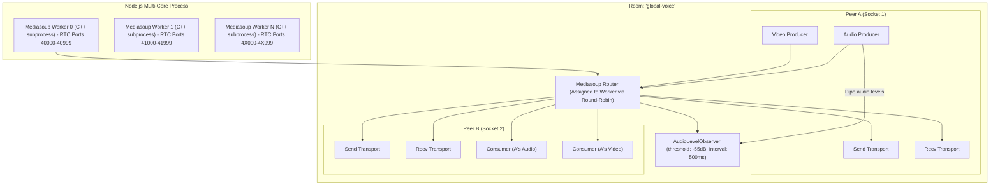

# 02. WebRTC, Media Routing & Voice/Video Deep Dive

This document is an in-depth technical analysis explaining WebRTC concepts, networking challenges (NAT/Firewalls), network protocols (STUN, TURN, ICE), Media Server topologies (Mesh vs. MCU vs. SFU), and advanced video optimization strategies (SVC vs. Simulcast, Active Speaker Routing).

---

## 🌐 1. WebRTC & NAT Traversal (STUN, TURN, ICE)

### What is the Problem WebRTC Solves?
WebRTC (Web Real-Time Communication) is an open standard that allows web browsers and mobile applications to exchange real-time audio, video, and arbitrary binary data with sub-second latency (usually < 100-200ms) directly over UDP/TCP.

However, devices on the modern internet are almost never directly connected with public IP addresses. They reside behind **NATs (Network Address Translation)** and firewalls (such as home WiFi routers or cellular carrier NATs).

```
[Client A (192.168.1.5)] ---> [Home Router (Public IP: 203.0.113.10)] ---> INTERNET
[Client B (192.168.0.22)] ---> [Office Router (Public IP: 198.51.100.4)] ---> INTERNET
```

If Client A tells Client B: *"Send video packets to `192.168.1.5:4000`"*, Client B will fail because `192.168.1.5` is a private, non-routable local network address.

---

### What is STUN? (Session Traversal Utilities for NAT)
**STUN** is a lightweight client-server protocol (RFC 5389).
- **Purpose**: It allows a client behind a NAT to discover its own **Public IP Address** and **Public Port** mapped by its router.
- **How it works**:
  1. Client sends a STUN Binding Request packet to a public STUN server (e.g., `stun:stun.l.google.com:19302`).
  2. The STUN server looks at the packet's source IP and port in the UDP header and replies: *"Hey, from the outside world, your address is `203.0.113.10:54321`"*.
  3. The client now knows its public reflexive candidate address to share with peers.

> **Analogy**: You are inside a hotel room with an internal extension. You call the front desk to ask: *"What external phone number and extension do outsiders see when I call out?"*

---

### What is TURN? (Traversal Using Relays around NAT)
**TURN** is an extension of STUN (RFC 5766) used when direct peer-to-peer connection is impossible.
- **Why STUN is not always enough**: When both clients are behind **Symmetric NATs** (common in corporate networks and mobile 4G/5G carriers), the NAT changes the external port for every different destination host. In this case, direct NAT hole punching fails.
- **How TURN works**: A TURN server acts as a public media relay. Both peers stream their audio/video packets to the TURN server, which forwards them to the other peer.

---

### What is ICE? (Interactive Connectivity Establishment)
**ICE** (RFC 8445) is the overarching framework used by WebRTC to find the best possible path to connect two endpoints.
- ICE collects all possible candidate network paths:
  1. **Host Candidates**: Local network IP (`192.168.x.x`).
  2. **Server Reflexive (srflx) Candidates**: Public IP and port discovered via **STUN**.
  3. **Relay Candidates**: Relay IP and port allocated on a **TURN** server.
- ICE tests connectivity across all candidate pairs and selects the fastest, lowest-latency path (prioritizing direct UDP > direct TCP > TURN relay).

---

## 🏛️ 2. Topologies: Mesh vs. MCU vs. SFU

When scaling real-time audio and video to groups of users (e.g., 5 to 50+ people in a voice/video channel), network topology is the single most critical architectural choice.

```
       1. MESH (P2P)                  2. MCU (Central Mixer)             3. SFU (Selective Forwarder)
    [A] <=========> [B]                     [A]       [B]                     [A]       [B]
     ^  \         /  ^                       \         /                       \         /
     |    \     /    |                        v       v                         v       v
     |      \ /      |                       [  MCU Server  ]                 [  SFU Server  ]
     v      / \      v                       (Decodes, Mixes,                  (Receives 1 stream,
     |    /     \    |                        Re-encodes video)                 Forwards selectively)
     v  /         \  v                        ^       ^                         v       v
    [C] <=========> [D]                      /         \                       /         \
                                           [C]       [D]                     [C]       [D]
```

### Topology Comparison Matrix

| Feature | Mesh (Pure P2P) | MCU (Multipoint Control Unit) | SFU (Selective Forwarding Unit) *(Used in this project)* |
| :--- | :--- | :--- | :--- |
| **Client Upload** | ❌ $O(N-1)$ — Uploads stream to *every* participant. Fails with > 4 peers. | ✅ $O(1)$ — Uploads 1 stream to server. | ✅ $O(1)$ — Uploads 1 stream to server. |
| **Client Download** | ❌ $O(N-1)$ — Downloads separate stream from each peer. | ✅ $O(1)$ — Receives 1 single composite grid video from server. | 🟡 $O(M)$ — Downloads only visible/desired streams. |
| **Server CPU Load** | ✅ $O(0)$ — Zero server CPU (pure client-to-client). | ❌ **Extremely High** — Server must decode, resize, compose, and re-encode video for every client. Very costly. | ✅ **Extremely Low** — Server never decodes or re-encodes video. It merely routes RTP packets at the packet level. |
| **Video Latency** | ✅ Lowest (direct P2P). | ❌ High (added transcoding & encoding pipeline delay). | ✅ Sub-second (~50-100ms, identical to P2P). |
| **Layout Flexibility** | 🟡 Client decides layout. | ❌ Fixed server-rendered layout for all users. | ✅ Full client flexibility (custom grids, pins, focus modes). |

### Why this project uses an SFU (Mediasoup):
Discord and modern conferencing platforms use SFUs because they combine the **low server CPU cost** of packet forwarding with the **$O(1)$ client upload efficiency** of a centralized media hub.

---

## ⚡ 3. Mediasoup SFU Internals in Demo Discord

Mediasoup is implemented across [`backend/src/voice/mediasoup.js`](file:///c:/Users/Sulaiman/Desktop/dis/backend/src/voice/mediasoup.js) and [`backend/src/voice/voice.socket.js`](file:///c:/Users/Sulaiman/Desktop/dis/backend/src/voice/voice.socket.js).



### Key Architectural Primitives in Mediasoup:
1. **Worker**: A separate OS subprocess running the C++ Mediasoup engine. In `mediasoup.js`, the code creates one worker per CPU core (`os.cpus().length`) with dedicated port ranges (`rtcMinPort: 40000 + i * 1000`) and automatic crash recovery (`worker.on('died')`).
2. **Router**: An RTP routing domain within a worker (analogous to a virtual room/channel).
3. **WebRtcTransport**: An ICE + DTLS connection representing a network pipe between a client browser and the Mediasoup worker. Each client creates two transports:
   - **Send Transport**: Dedicated exclusively to publishing the client's own microphone and camera tracks.
   - **Recv Transport**: Dedicated to receiving media tracks published by other participants.
4. **Producer**: Represents an incoming audio or video track sent by a client to the SFU router.
5. **Consumer**: Represents an outgoing audio or video track delivered from the SFU router to a client's receive transport.

---

## 🎥 4. SVC (Scalable Video Coding) vs. Simulcast

In a group video call, different clients have wildly different network speeds and screen sizes:
- A user on a 4K monitor needs high-definition (1080p).
- A mobile user on a 4G connection needs lower resolution (360p) to conserve bandwidth.
- A user viewing 16 small video tiles in a grid only needs low-resolution thumbnails.

How do we solve this without having the server transcode the video? We use **SVC** or **Simulcast**.

```
                       SIMULCAST (3 Independent Streams)
[Client Camera] ----> Encoder 1: 1080p @ 2.5 Mbps (High)
                ----> Encoder 2: 720p  @ 1.0 Mbps (Medium)
                ----> Encoder 3: 360p  @ 300 Kbps (Low)
                                     |
                                     v
                           [ Mediasoup SFU ]
                          /        |        \
                         /         |         \
   (Sends High to Speaker) (Sends Med to Grid) (Sends Low to Mobile)


                 SCALABLE VIDEO CODING - SVC (Single Layered Stream)
[Client Camera] ----> [ Spatial Layer 2 (High detail delta) ]
                ----> [ Spatial Layer 1 (Medium detail delta) ]
                ----> [ Spatial Layer 0 (Base Layer 360p) ]
                                     |
                                     v
                           [ Mediasoup SFU ]
                          /        |        \
                         /         |         \
           (Forwards L0+L1+L2)  (Forwards L0+L1)  (Forwards L0 only)
```

### What is SVC (Scalable Video Coding)?
SVC (e.g., in codecs like VP9 or AV1) encodes video into a single structured bitstream containing multiple **Spatial Layers** (resolutions) and **Temporal Layers** (frame rates):
- **Base Layer (Spatial 0, Temporal 0)**: Minimal resolution and frame rate (e.g., 360p @ 15fps). Anyone can decode this.
- **Enhancement Layer 1 (Spatial 1, Temporal 1)**: Adds resolution details (e.g., 720p @ 30fps).
- **Enhancement Layer 2 (Spatial 2, Temporal 2)**: Adds full HD details (e.g., 1080p @ 60fps).

### Why do we use SVC / Simulcast in Demo Discord?
In [`voice.socket.js` (Lines 619-632)](file:///c:/Users/Sulaiman/Desktop/dis/backend/src/voice/voice.socket.js#L619-L632), the SFU dynamically tells the consumer which layers to forward based on active speaking and visibility:

```javascript
if (consumer.type === "simulcast" || consumer.type === "svc") {
  let spatialLayer = 0;

  if (isSpeaker) spatialLayer = 2;       // HD for active speaker
  else if (isVisible) spatialLayer = 1;  // Medium for visible tile
  else spatialLayer = 0;                 // Lowest for background

  consumer.setPreferredLayers({
    spatialLayer,
    temporalLayer: isSpeaker ? 2 : 1,
  }).catch(() => {});
}
```

**Benefits**:
1. **Zero Server Transcoding**: The server only strips or passes RTP packets belonging to specific layer IDs.
2. **Dynamic Bandwidth Adaptation**: If the network drops packets, the SFU instantly drops to `spatialLayer: 0` without breaking the video stream.

---

## 🎙️ 5. Active Speaker Detection & Dynamic Consumer Management

In large video rooms (e.g., 20+ users), forwarding 20 video streams simultaneously will crash the browser and overwhelm network bandwidth. The codebase implements an optimization pipeline:

### 1. Hardware AudioLevelObserver
Configured in [`voice.socket.js`](file:///c:/Users/Sulaiman/Desktop/dis/backend/src/voice/voice.socket.js#L164-L195):
- Mediasoup monitors audio RTP volume levels in C++ without decoding audio.
- Triggers `volumes` events when audio exceeds `-55 dB`.
- Emits `voice:activeSpeaker` over WebSocket to all clients.

### 2. Viewport-Based Selective Subscription
- **Focus Mode**: Limits video subscriptions to the top 6 users (including active speaker). Sets max bitrate to 2.0 Mbps.
- **Gallery Mode**: Limits video subscriptions to 16 users. Sets max bitrate to 800 Kbps.
- Users outside the current visible page have their video consumers **paused** (`consumer.pause()`), saving 100% of video bandwidth for off-screen peers.

### 3. Staggered Consumer Resumption & Keyframe Control
When switching pages or promoting a speaker, resuming multiple video consumers at once causes a **thundering herd** of keyframe requests (which spikes CPU and packet loss).

In [`voice.socket.js` (Lines 608-643)](file:///c:/Users/Sulaiman/Desktop/dis/backend/src/voice/voice.socket.js#L608-L643):
- Resumption is staggered with an incremental timer (`resumeIndex * 15ms`).
- Keyframes are throttled (`Date.now() - consumer.appData.lastKeyframe > 3000`) to prevent packet bursts.
