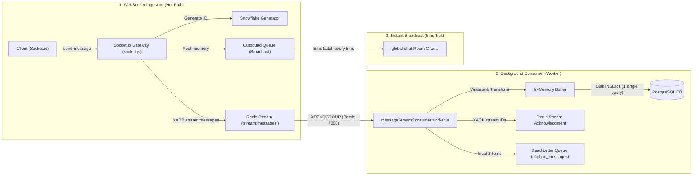
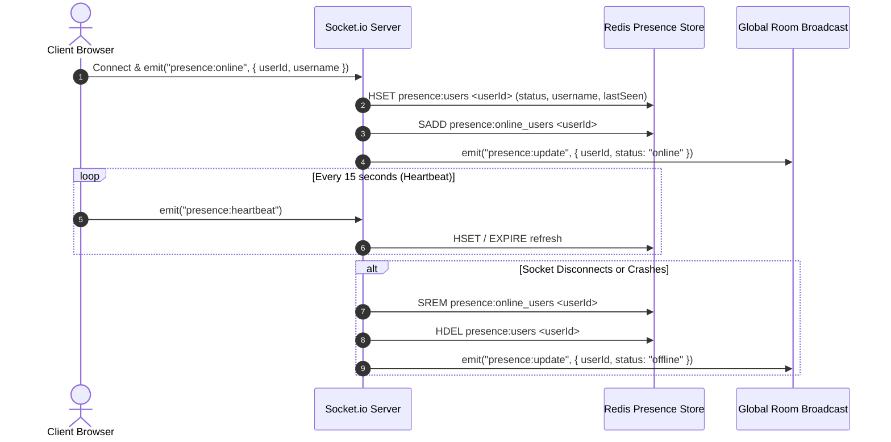
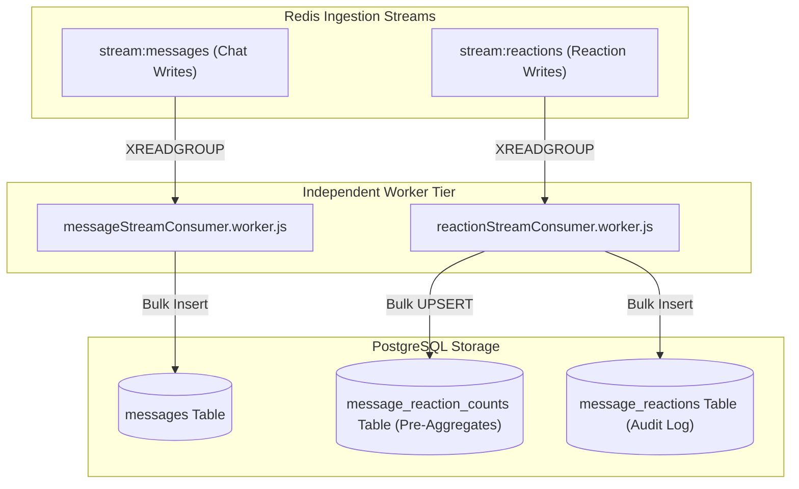

# 03. Real-Time Messaging & Distributed Scale

This document analyzes the high-throughput real-time messaging pipeline, distributed ID generation, write buffering, presence tracking, and background processing systems implemented in **Demo Discord**.

---

## ❄️ 1. Distributed 64-bit Snowflake ID Generation

### The Problem with Traditional Primary Keys
At Discord scale (millions of concurrent messages):
1. **Database Auto-Increment (`SERIAL / BIGSERIAL`)**: Requires a centralized database lock on every write. This creates a severe write bottleneck when horizontal backend nodes ingest messages concurrently.
2. **UUIDv4 (Random 128-bit)**: Completely unsorted. Inserting random UUIDs into a B-Tree index causes index page thrashing, high memory overhead, and makes chronological pagination (`WHERE id < oldest_id`) impossible without secondary indexed timestamp scans.

---

### The Solution: Twitter Snowflake Algorithm
Implemented in [`backend/src/snowflake.js`](file:///c:/Users/Sulaiman/Desktop/dis/backend/src/snowflake.js), this project generates **64-bit k-sortable unique integers** completely in-memory on each node without any database locks.

```
 +-------------------------------------------------------------------------+
 | 1 Bit |   41 Bits (Timestamp)   | 5 Bits (Datacenter) | 5 Bits (Worker) | 12 Bits (Sequence) |
 | Unused|  Milliseconds since     |   Datacenter ID     |   Worker / Node |  0 - 4095 per ms   |
 |  (0)  |  Custom Epoch (2020)    |      (0 - 31)       |   PID/Host (31) |   per worker       |
 +-------------------------------------------------------------------------+
```

### Bit Allocation Breakdown:
* **1 Sign Bit**: Always `0` for positive integers.
* **41 Timestamp Bits**: Milliseconds elapsed since a custom epoch (`EPOCH = 1577836800000n` — Jan 1, 2020). $2^{41}$ ms lasts **~69 years** without overflow.
* **5 Datacenter Bits**: Identifies the regional datacenter (supports up to $2^5 = 32$ datacenters).
* **5 Worker Bits**: Identifies the specific node/worker instance (derived from hostname hash + process PID: `Math.abs((hash + pid) % 32)`).
* **12 Sequence Bits**: Per-millisecond counter (supports $2^{12} = 4096$ unique IDs per millisecond *per worker*).

### Why Snowflakes Power Discord Chat:
1. **Naturally Chronological**: Because timestamp is in the highest significant bits, `ORDER BY snowflake DESC` naturally orders messages chronologically.
2. **Fast Cursor Pagination**: The frontend can fetch older messages using `GET /api/messages?before=<snowflake>` using a direct B-tree range scan on the primary index.
3. **Zero Coordination Overhead**: Any number of Node.js instances can generate millions of globally unique, conflict-free IDs per second without talking to each other or to PostgreSQL.

---

## 🌊 2. Redis Streams Ingestion Pipeline & DB Flushing

In a chat application during peak traffic (e.g., thousands of messages sent per second across channels), writing each message synchronously to PostgreSQL (`INSERT INTO messages ...`) will saturate DB connection pools and block WebSocket threads.

The codebase implements a **Write-Behind / Ingestion Queue pattern** using **Redis Streams**:



### 1. The Ingestion Hot Path (`socket.js` & `messageStream.js`)
When a user sends a message:
1. The server generates a Snowflake ID and constructs the message payload.
2. The message is pushed to an in-memory `outboundQueue` to broadcast to other online users immediately.
3. The message is queued to Redis via `redis.xadd("stream:messages", "MAXLEN", "~", 500000, ...)` protected by `p-limit(50)` concurrency throttler.
4. An acknowledgment (`ack?.({ ok: true, snowflake })`) is returned to the sending client immediately within **< 2-5 milliseconds**, without waiting for disk writes in PostgreSQL.

### 2. Micro-Batched Worker Persistence (`messageStreamConsumer.worker.js`)
A dedicated background worker reads messages from Redis Stream using a consumer group (`XREADGROUP`):
- **Batching**: Accumulates up to **4,000 messages** or flushes every **100ms** (`FLUSH_INTERVAL = 100`).
- **Bulk Insert**: Executes a single multi-row SQL insert via Drizzle ORM:
  ```javascript
  await db.insert(messages).values(validMessages).onConflictDoNothing();
  ```
- **Acknowledgment (`XACK`)**: Once the PostgreSQL transaction successfully commits, the worker sends `XACK` to Redis to prune processed stream records.
- **Dead Letter Queue (DLQ)**: Any malformed or invalid payload is forwarded to `dlq:consumer:bad_messages` rather than crashing the consumer or blocking the stream.

---

## 👥 3. Redis-Backed Sliding Presence System

Implemented in [`backend/src/redis/presence.js`](file:///c:/Users/Sulaiman/Desktop/dis/backend/src/redis/presence.js):



### Dual-State Presence Architecture:
1. **Initial Full Sync**: On connection, the client receives the entire list of currently online users (`getOnlineUsers()`).
2. **Delta Updates**: As users join, disconnect, or go idle, lightweight delta packets (`{ userId, username, status }`) are emitted to `global-chat`.
3. **Multi-Socket Safety**: If a user has 3 browser tabs open, closing 1 tab does not mark them offline; `presence.js` tracks socket IDs per user to ensure the user is only marked offline when all sockets disconnect.

---

## 🚦 4. Sliding Window Rate Limiter

Implemented in [`backend/src/redis/ratelimiter.js`](file:///c:/Users/Sulaiman/Desktop/dis/backend/src/redis/ratelimiter.js):
- Prevents spam attacks and message flooding.
- Tracks per-user request counts over a rolling window using Redis atomic counters with TTL expiration.

---

## 📬 5. Asynchronous Job Queues (BullMQ)

Heavy background tasks that should not block chat or voice signaling are routed to BullMQ queues powered by Redis:
- **Notification Queue** ([`notification.queue.js`](file:///c:/Users/Sulaiman/Desktop/dis/backend/src/queues/notification.queue.js) & [`notification.worker.js`](file:///c:/Users/Sulaiman/Desktop/dis/backend/src/workers/notification.worker.js)): Dispatches push notifications, email alerts, and in-app sound events based on user preferences.
- **Analytics Queue** ([`analytics.queue.js`](file:///c:/Users/Sulaiman/Desktop/dis/backend/src/queues/analytics.queue.js) & [`analytics.worker.js`](file:///c:/Users/Sulaiman/Desktop/dis/backend/src/workers/analytics.worker.js)): Ingests user telemetry and message events into the `analytics_events` PostgreSQL table for offline metric aggregation.

---

## ⚡ 6. High-Throughput Reaction Engine & Dual-Stream Architecture

To handle viral announcement events where thousands of users react to a message simultaneously, the application employs a decoupled **Dual-Stream Architecture**:



1. **In-Memory Atomicity**: Reaction clicks update Redis Hashes (`reactions:counts:{snowflake}`) and Sets (`reactions:users:{snowflake}:{emoji}`) in **<0.2ms**, preventing database lock contention.
2. **250ms Sliding-Window Broadcast**: The Socket.io Gateway coalesces incoming reaction deltas across a 250ms buffer and emits a single consolidated frame (`reaction:batch_update`) to the room, reducing outbound WebSocket traffic by over **99%**.
3. **Decoupled Persistence**: `reactionStreamConsumer.worker.js` continuously drains `stream:reactions`, micro-batching updates into PostgreSQL without blocking chat or voice throughput.
