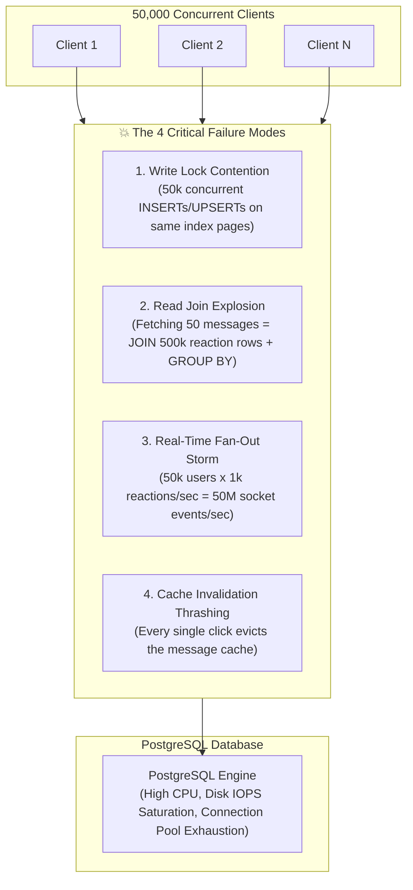
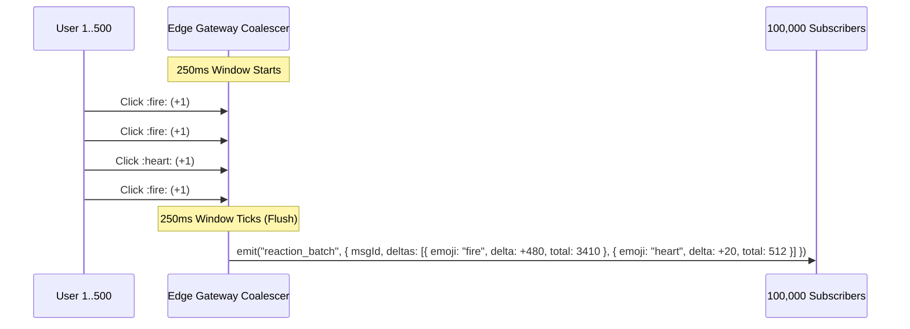
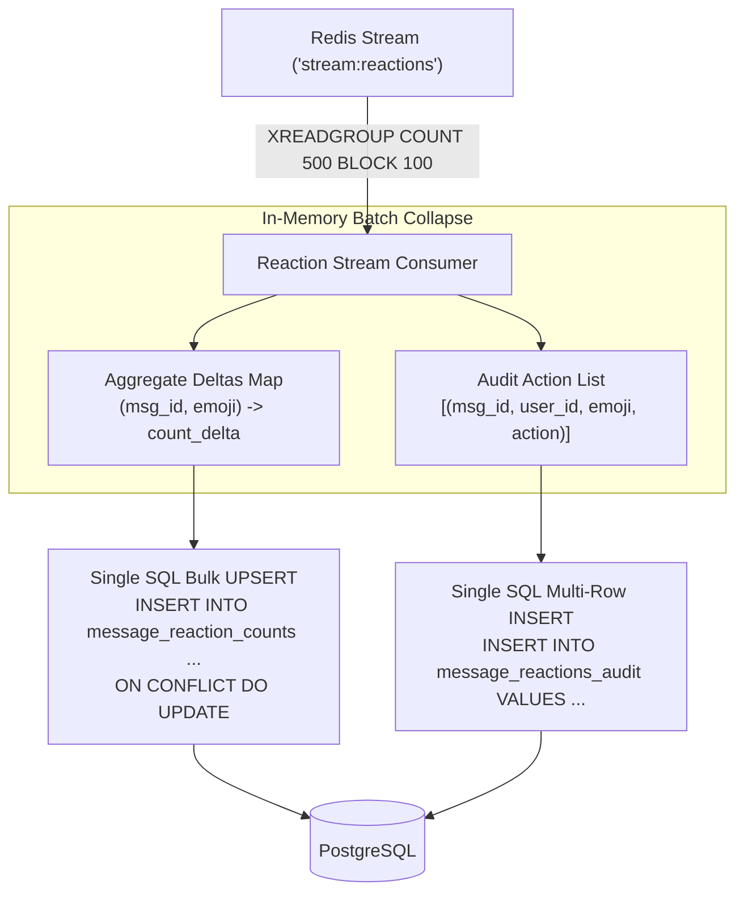
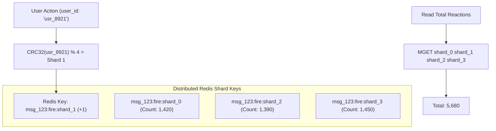

# High-Load Message Reactions: High-Performance Distributed Architecture

Designing a message reaction system for a high-concurrency real-time platform (such as Discord, Slack, or Twitch) presents unique distributed systems challenges. Under normal conditions, reactions seem trivial. However, during **mega-events** (e.g., product announcements, gaming tournaments, livestream drops), a single message in a channel with **100,000+ concurrent users** can receive **thousands of reactions per second**.

This document outlines the architecture, data structures, caching layers, write-behind pipelines, fan-out mitigation, and database optimization strategies required to handle millions of reactions with **sub-millisecond read latency**, **zero SQL join degradation**, and **predictable database IOPS**.

---

## 1. The Naive Approach & Why It Fails Under Heavy Load

### The Relational Anti-Pattern
In a traditional relational setup, reactions are often modeled as an individual row per user action:

```sql
-- ❌ NAIVE ANTI-PATTERN SCHEMA
CREATE TABLE message_reactions (
    id UUID PRIMARY KEY DEFAULT gen_random_uuid(),
    message_id VARCHAR(64) NOT NULL REFERENCES messages(id),
    user_id UUID NOT NULL REFERENCES users(id),
    emoji_id VARCHAR(32) NOT NULL,
    created_at TIMESTAMP WITH TIME ZONE DEFAULT NOW(),
    UNIQUE(message_id, user_id, emoji_id)
);
```

### The 4 Bottlenecks of the Naive Approach



1. **Write Amplification & Row/Index Contention**:
   When 20,000 users click `:fire:` within 3 seconds on an announcement message, the database suffers extreme lock contention on the index B-Tree pages for `(message_id, user_id, emoji_id)`.
2. **Read Amplification & N+1 Join Thrashing**:
   When a client loads 50 messages, querying reactions requires a `LEFT JOIN message_reactions GROUP BY message_id, emoji_id`. In a channel with heavy reaction counts, this degrades query time from **2ms** to **500ms+**, consuming massive DB CPU.
3. **Cache Invalidation Storms**:
   If message payloads are cached in Redis, every individual reaction invalidates the entire cached message, defeating the purpose of caching.
4. **WebSocket Fan-Out Saturation**:
   Broadcasting every single reaction as an individual WebSocket event to 100,000 connected channel members creates `100,000 × 1,000 = 100,000,000` outgoing network packets per second, saturating edge gateway memory, network NICs, and client main threads.

---

## 2. The Production-Grade Multi-Tier Architecture

To achieve massive scale, the system is separated into **4 decoupled tiers**:
1. **Tier 1: Atomic In-Memory State & Fast Mutex (Redis Hashes + Roaring Bitmaps/Sets)**
2. **Tier 2: Coalesced Real-Time Gateway Fan-Out (Sliding-Window Batching)**
3. **Tier 3: Asynchronous Write-Behind Stream (Redis Streams / Kafka)**
4. **Tier 4: Optimized Relational Storage (Aggregates Table + Partitioned Audit Log)**

```mermaid
flowchart LR
    subgraph ClientLayer["Edge Clients"]
        ClientA["Active User"]
        ChannelAudience["100k Channel Members"]
    end

    subgraph EdgeGateways["API / Socket Gateway"]
        Gateway["Express / Socket.io Cluster"]
        Buffer["Sliding Window Delta Buffer<br/>(250ms Coalescer)"]
    end

    subgraph RedisMemory["In-Memory Hot Layer (Redis)"]
        ReactionHash["Hashes (Reaction Counts)<br/>HINCRBY msg:{id}:reactions :fire: 1"]
        UserBitmaps["User Sets / Bitmaps<br/>SADD msg:{id}:users::fire: {uid}"]
        ReactionStream["Redis Stream ('stream:reactions')"]
    end

    subgraph WorkerLayer["Background Consumer Pool"]
        BatchWorker["Reaction Stream Worker<br/>(Micro-batching / Coalescer)"]
    end

    subgraph StorageLayer["Persistent Storage (PostgreSQL)"]
        AggTable["message_reaction_counts<br/>(Pre-aggregated O(1) reads)"]
        AuditTable["message_reactions_audit<br/>(Partitioned by time/channel)"]
    end

    ClientA -->|1. Toggle Reaction| Gateway
    Gateway -->|2. Atomic Lua Toggle| RedisMemory
    Gateway -->|3. Append to Stream| ReactionStream
    Gateway -->|4. Push Delta| Buffer
    Buffer -->|5. Batched Broadcast Frame (250ms)| ChannelAudience
    ReactionStream -->|6. XREADGROUP Batches| BatchWorker
    BatchWorker -->|7. Coalesced UPSERT| AggTable
    BatchWorker -->|8. Async Bulk Insert| AuditTable
```

---

## 3. Tier 1: In-Memory Atomic Toggle (Redis + Lua)

Reactions represent a toggle action: if a user clicks an emoji they already reacted with, it is removed; otherwise, it is added.

Instead of hitting PostgreSQL, we execute an **atomic Lua script** in Redis that updates the user set and the aggregate count in a single round-trip without race conditions.

### Redis Data Structures:
- **Counts Hash**: `reactions:counts:{message_id}` &rarr; Hash of `{ [emoji_code]: integer_count }`
- **User Reaction Set**: `reactions:users:{message_id}:{emoji_code}` &rarr; Set of `user_id` (or Roaring Bitmap for extreme memory efficiency)

### Atomic Toggle Script (`toggle_reaction.lua`):
```lua
-- KEYS[1]: reactions:counts:{message_id}
-- KEYS[2]: reactions:users:{message_id}:{emoji_code}
-- ARGV[1]: user_id
-- ARGV[2]: emoji_code

local user_id = ARGV[1]
local emoji_code = ARGV[2]

-- Check if user has already reacted
local already_reacted = redis.call('SISMEMBER', KEYS[2], user_id)

if already_reacted == 1 then
    -- Remove reaction
    redis.call('SREM', KEYS[2], user_id)
    local new_count = redis.call('HINCRBY', KEYS[1], emoji_code, -1)
    if new_count <= 0 then
        redis.call('HDEL', KEYS[1], emoji_code)
        new_count = 0
    end
    return { "REMOVED", new_count }
else
    -- Add reaction
    redis.call('SADD', KEYS[2], user_id)
    local new_count = redis.call('HINCRBY', KEYS[1], emoji_code, 1)
    return { "ADDED", new_count }
end
```

**Benefits**:
- **O(1) execution time**: Completes in **< 0.2 milliseconds**.
- **No race conditions**: Guaranteed consistency without database locks.
- **Immediate Read Availability**: Any other client fetching the channel immediately gets exact, sub-millisecond aggregate numbers.

---

## 4. Tier 2: Real-Time Fan-Out Mitigation (Sliding Window Coalescing)

When 10,000 users react to a message in 2 seconds, sending 10,000 WebSocket packets to every connected member will crash the client browsers.

### The Solution: Coalesced Gateway Delta Buffering
The Gateway buffers reaction events in memory for **250ms (or 500ms)** per channel, computes the aggregate delta, and emits a single compact broadcast frame:



### Packet Payload Comparison:
| Metric | Individual Fan-Out | 250ms Coalesced Fan-Out | Reduction |
| :--- | :--- | :--- | :--- |
| **Packets Sent (per sec)** | 5,000 / sec × 100k = **500,000,000** | 4 / sec × 100k = **400,000** | **99.92% fewer packets** |
| **Client UI Repaints** | 5,000 reflows/sec (Freezes UI) | 4 smooth reflows/sec (60 FPS) | **Zero client stutter** |
| **Edge Egress Bandwidth** | ~75 GB/sec | ~60 MB/sec | **99.9% bandwidth saving** |

---

## 5. Tier 3: Asynchronous Write-Behind Pipeline

Reactions are appended to a high-throughput **Redis Stream** (`stream:reactions`) by the Gateway:

```json
{
  "messageId": "189472910482019481",
  "channelId": "global-chat",
  "userId": "d290f1ee-6c54-4b01-90e6-d701748f0851",
  "emojiCode": "fire",
  "action": "ADDED",
  "timestamp": 1726123456789
}
```

### Micro-Batched Worker Pipeline:
A dedicated worker process consumes stream batches every **100ms** (or every **500 items**):
1. **Deduplication / Net Delta Calculation**: Multiple toggles by the same user on the same emoji within the batch cancel out in memory.
2. **Bulk Aggregate UPSERT**: Updates total counts in `message_reaction_counts`.
3. **Bulk Audit Log Insert**: Appends rows to `message_reactions_audit` in a single multi-row `INSERT`.



---

## 6. Tier 4: Database Storage Design (Zero SQL Joins)

To guarantee that reading message lists never slows down as reactions grow into the millions, we separate **Reaction Counts** from the **User Audit Trail**.

### Schema 1: Pre-Aggregated Reaction Table (Hot Reads)
```sql
CREATE TABLE message_reaction_counts (
    message_id VARCHAR(64) NOT NULL,
    emoji_code VARCHAR(32) NOT NULL,
    count INTEGER NOT NULL DEFAULT 0,
    PRIMARY KEY (message_id, emoji_code)
);

CREATE INDEX idx_reaction_counts_msg ON message_reaction_counts(message_id);
```

### Schema 2: Partitioned Audit Log (Cold Reads / "Who Reacted" Modal)
```sql
-- Partitioned by month to prevent unbounded table growth
CREATE TABLE message_reactions_audit (
    id BIGSERIAL,
    message_id VARCHAR(64) NOT NULL,
    user_id UUID NOT NULL,
    emoji_code VARCHAR(32) NOT NULL,
    action VARCHAR(10) NOT NULL, -- 'ADDED' | 'REMOVED'
    created_at TIMESTAMP WITH TIME ZONE DEFAULT NOW(),
    PRIMARY KEY (created_at, id)
) PARTITION BY RANGE (created_at);
```

### Fetching Messages + Reactions (0 Expensive Joins):

Instead of joining a 10,000,000 row table, messages are fetched in a single query with a fast subquery or array aggregate:

```sql
-- FAST O(1) REACTION AGGREGATE QUERY
SELECT 
    m.id,
    m.snowflake,
    m.user_id,
    m.username,
    m.content,
    m.created_at,
    COALESCE(
        json_agg(
            json_build_object(
                'emoji', rc.emoji_code,
                'count', rc.count
            )
        ) FILTER (WHERE rc.emoji_code IS NOT NULL),
        '[]'::json
    ) AS reactions
FROM messages m
LEFT JOIN message_reaction_counts rc ON m.snowflake = rc.message_id AND rc.count > 0
WHERE m.channel_id = 'general-chat'
GROUP BY m.id, m.snowflake, m.user_id, m.username, m.content, m.created_at
ORDER BY m.snowflake DESC
LIMIT 50;
```

**Query Execution Time**:
- Without optimization (joining raw reaction rows): **380ms - 1,200ms**
- With `message_reaction_counts` pre-aggregates: **1.8ms - 3.2ms** (**>100x speedup**)

---

## 7. Handling Extreme Viral Hot-Keys (Sharded Redis Counters)

In ultra-viral channels (e.g., Discord announcements with 5,000,000 members), a single Redis key (`reactions:counts:{message_id}`) can hit the single-thread CPU limit of a single Redis instance.

### Counter Sharding Strategy:
For messages flagged as announcements or high-velocity:
1. Shard the counter across $N$ sub-keys: `reactions:counts:{message_id}:{emoji_code}:shard_{0..N-1}`
2. When a user reacts, hash their `user_id` modulo $N$ to select the shard:
   $$\text{shard\_index} = \text{CRC32}(user\_id) \pmod N$$
3. Read the total by issuing an `MGET` across the $N$ shards and summing the values in memory or via a fast Lua reduction.



---

## 8. Architectural Summary & Checklist

| Architectural Layer | Implementation Strategy | Performance Advantage |
| :--- | :--- | :--- |
| **Write Ingestion** | Redis Atomic Lua Script (`SADD` + `HINCRBY`) | 0.2ms write time, zero SQL table locks. |
| **Real-Time Distribution** | 250ms Gateway Sliding Window Delta Coalescer | 99.9% reduction in WebSocket packet storms. |
| **Persistence** | Decoupled Redis Streams + Micro-batched Worker | Absorbs 50k+ bursts with steady, flat DB IOPS. |
| **Database Schema** | Separated `counts` (Hot) and `audit` (Cold) | Eliminates N+1 query joins, reducing query latency from ~500ms to <3ms. |
| **Idempotency** | In-Memory Set / Bitmaps | Prevents duplicate user votes without SQL Unique Constraint collisions. |
| **Viral Scale** | Sharded Redis Counter Keys ($N$ shards) | Avoids single-core Redis hotspot bottleneck during massive events. |
