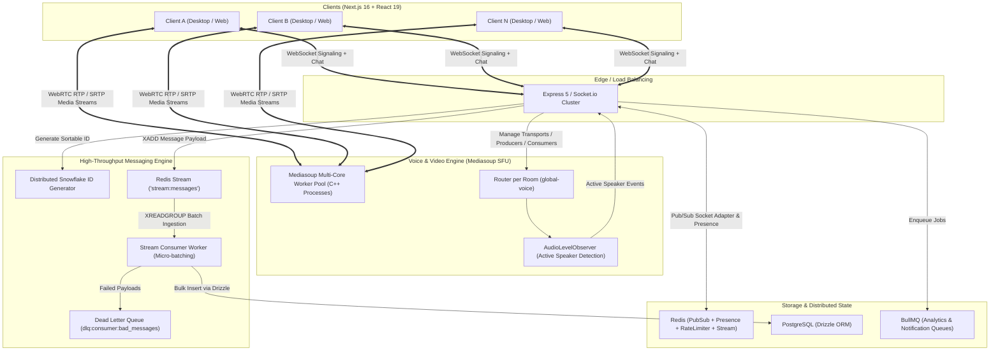

# Demo Discord — Architecture & Engineering Documentation

Welcome to the comprehensive technical documentation and architectural analysis for the **Demo Discord** project. This documentation breaks down all technologies used, architectural decisions, streaming pipelines, real-time communication protocols, and underlying computer science concepts (including WebRTC, STUN, ICE, SFU, SVC, Snowflake IDs, and Redis Streams).

---

## 📑 Documentation Index

| Document | Description |
| :--- | :--- |
| **[01. Architecture & Tech Stack](./01_ARCHITECTURE_AND_TECH_STACK.md)** | Full breakdown of backend, frontend, database, worker processes, and third-party tools. |
| **[02. WebRTC, Media Routing & Voice/Video Deep Dive](./02_WEBRTC_AUDIO_VIDEO_DEEP_DIVE.md)** | Clear conceptual and practical explanations of STUN, TURN, ICE, SFU vs MCU vs Mesh, Mediasoup internals, SVC, Simulcast, Audio Observers, and Bandwidth Control. |
| **[03. Real-Time Messaging & Distributed Scale](./03_REALTIME_MESSAGING_AND_DISTRIBUTED_SCALE.md)** | In-depth analysis of 64-bit Snowflake ID generation, Redis Streams ingestion pipeline, Pub/Sub clustering, Presence heartbeats, and BullMQ async queues. |
| **[04. Engineering Approaches & Production Patterns](./04_ENGINEERING_APPROACHES_AND_PATTERNS.md)** | Architectural patterns implemented: Decoupled write pipelines, Dead Letter Queues (DLQ), Micro-batching, Viewport-based media subscriptions, and Load testing. |

---

## 🏗 High-Level System Topology

---

## 🎯 Key Highlights of the Codebase

1. **Discord-Class Voice & Video (SFU via Mediasoup v3)**:
   - Eliminates client upload bottleneck using an SFU model.
   - Multi-core C++ worker orchestration running 1 worker per CPU core.
   - Scalable Video Coding (SVC) and Simulcast support with dynamic layer switching (spatial and temporal).
   - Real-time Audio Level Observer detecting active speakers to dynamically adjust video resolution and priority.

2. **Decoupled High-Throughput Chat Pipeline**:
   - Ingestion over WebSockets decoupled from database persistence.
   - Micro-batched Redis Streams (`XADD` / `XREADGROUP`) achieving thousands of messages per second.
   - Guaranteed at-least-once processing, consumer groups, automatic recovery, and Dead Letter Queue.

3. **Distributed Snowflake ID Generation**:
   - 64-bit k-sortable unique IDs based on Twitter's Snowflake algorithm.
   - Eliminates database primary key lock contention and enables chronological cursor pagination without offset performance degradation.

4. **Resilient Presence & PubSub Clustering**:
   - Redis-backed sliding window presence with heartbeat refreshing.
   - Socket.io Redis adapter enabling zero-downtime horizontal scaling across multiple Node.js instances.
